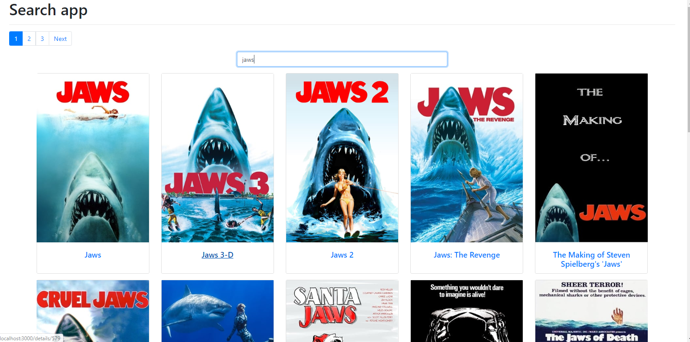
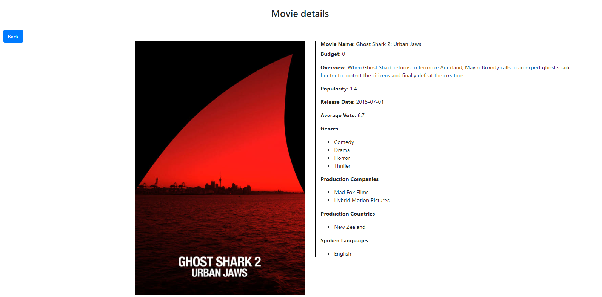

# 3pc Coding Challenge React

## Prerequisites

**You’ll need to have Node >= 8.9 on your local development machine**. 
If needed install NodeJS from their [website](https://nodejs.org/en/).

Run `npm i` in the root of the project to install the needed packages.

## Start Coding

You can run the following commands:

### `npm start`

Runs the app in development mode. 
Open [http://localhost:3000](http://localhost:3000) to view it in the browser.

The page will automatically reload if you make changes to the code. 
You will see the build errors and lint warnings in the console.

## Your Challenge

Create an app to search and find films.

The app consists of **two pages**:

- The **search** consists of an input field and a list of the films found. The films should be sorted by **popularity**.
- The **film page** shows details of the selected film.

You can orient yourself on the given design, expand it or even change it.
The design of the detail page is up to you.

If the detail page is reloaded, it should be loaded correctly.

## Requirements

Use the [The Movie DB API](https://developers.themoviedb.org/3) for your requests.

In `.env.local` is some helpful stuff:

- you have to attach the `API Key` to every request.
- the `path to your API`.
- the `path to movie images`. You can read how to use it [here](https://developers.themoviedb.org/3/getting-started/images).

You can use all values ​​via `process.env.{KEY}`, e.g. you can use the `API Key` with `process.env.REACT_APP_API_KEY`.

> If you want to upload the project to Github, make sure that you **don't** commit the API key.

---
Please see the `screenshot` to see the view

You can find out more about the development environment and its possibilities in the [Create React App Documentation](https://create-react-app.dev/).
